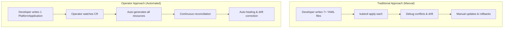
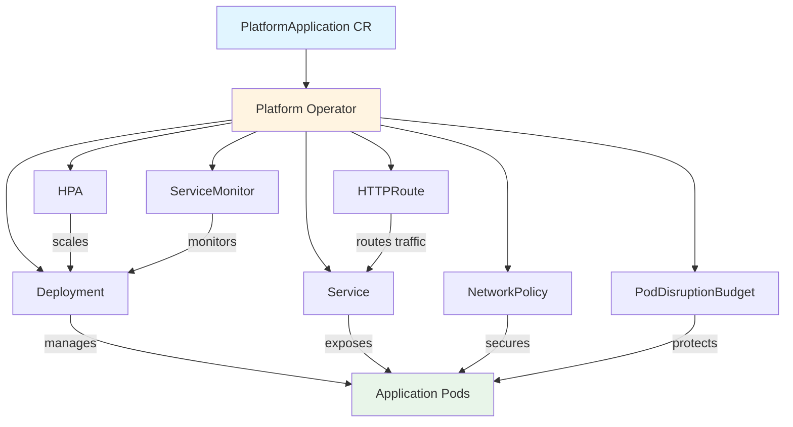

# Kubernetes Platform Operator

[](https://github.com/shakthi-vinayak/Kubernetes-Operators/actions/workflows/ci.yaml)
[](https://goreportcard.com/report/github.com/example/platform-operator)
[](LICENSE)
[](go.mod)

A production-grade Kubernetes operator that simplifies application deployment by replacing 7+ individual Kubernetes resources with a single declarative `PlatformApplication` custom resource.

---

## What is a Kubernetes Operator?

A **Kubernetes Operator** is a method of packaging, deploying, and managing complex applications on Kubernetes using custom APIs and automated control loops.

### The Problem Operators Solve

Without operators, deploying a production application requires manually creating and maintaining multiple Kubernetes resources:

- **Deployment** - Container orchestration, replicas, rolling updates
- **Service** - Network abstraction, load balancing
- **HorizontalPodAutoscaler (HPA)** - Automatic scaling based on metrics
- **HTTPRoute** - Gateway API ingress routing
- **NetworkPolicy** - Security and traffic control
- **PodDisruptionBudget (PDB)** - High availability during disruptions
- **ServiceMonitor** - Prometheus metrics collection

Each resource must be individually authored, tested, updated, and debugged. This creates:
- **Complexity** - Developers must understand 7+ resource types and their interactions
- **Inconsistency** - Manual configuration leads to drift and human error
- **Operational burden** - Repetitive YAML authoring and maintenance
- **Security risks** - Misconfigured resources expose vulnerabilities

### How Operators Work

Operators extend Kubernetes with **Custom Resource Definitions (CRDs)** and **controllers** that automate the entire lifecycle:



The operator implements a **reconciliation loop**: it continuously compares the desired state (your `PlatformApplication` spec) with the actual state (cluster resources) and takes corrective action to align them.

---

## How This Operator Helps Development

### 1. **Simplified Developer Experience**

**Before:** Developers write 200+ lines of YAML across 7 files
```yaml
# deployment.yaml (50 lines)
# service.yaml (20 lines)
# hpa.yaml (30 lines)
# httproute.yaml (40 lines)
# networkpolicy.yaml (25 lines)
# pdb.yaml (15 lines)
# servicemonitor.yaml (20 lines)
```

**After:** Developers write 1 concise `PlatformApplication` (40 lines)
```yaml
apiVersion: platform.example.io/v1beta1
kind: PlatformApplication
metadata:
  name: payment-service
spec:
  image:
    repository: ghcr.io/example/payment-service
    tag: "2.4.1"
  replicas:
    min: 3
    max: 10
  service:
    port: 8080
  autoscaling:
    enabled: true
    targetCPUUtilization: 70
  gateway:
    enabled: true
    host: payments.example.com
  security:
    networkPolicy: true
  observability:
    metrics: true
```

### 2. **Automated Best Practices**

The operator automatically applies production-hardened defaults:
- ✅ Non-root containers with read-only filesystems
- ✅ Resource requests/limits for QoS guarantees
- ✅ Liveness and readiness probes for health monitoring
- ✅ PodDisruptionBudgets for rolling update safety
- ✅ NetworkPolicies for zero-trust networking
- ✅ Anti-affinity rules for high availability

### 3. **Self-Healing & Drift Correction**

The operator uses **Server-Side Apply (SSA)** to detect and correct configuration drift:
- Someone manually scales the Deployment? → Operator reverts to spec
- A label is removed from the Service? → Operator restores it
- The HPA target CPU is changed? → Operator corrects it

### 4. **GitOps-Friendly**

The single `PlatformApplication` resource is perfect for Git-based workflows:
- Store application definitions in Git
- Use Argo CD or Flux to sync to clusters
- Audit changes via Git history
- Rollback by reverting commits

### 5. **Multi-Environment Consistency**

Use Kustomize overlays to deploy the same application across environments:
```bash
# Dev: 1 replica, minimal resources
kubectl apply -k config/overlays/dev/

# Staging: 2 replicas, moderate resources
kubectl apply -k config/overlays/staging/

# Production: 3 replicas, full HA + monitoring
kubectl apply -k config/overlays/production/
```

---

## What Gets Automated

When you create a `PlatformApplication`, the operator automatically generates and manages:



### Resource Generation Logic

| Resource | When Created | Key Features |
|----------|--------------|--------------|
| **Deployment** | Always | Container spec, replicas, probes, security context, anti-affinity |
| **Service** | Always | Port mapping, selectors, ClusterIP/NodePort/LoadBalancer |
| **HPA** | `autoscaling.enabled: true` | Min/max replicas, CPU/memory targets |
| **HTTPRoute** | `gateway.enabled: true` | Gateway API routing, hostname, path matching |
| **NetworkPolicy** | `security.networkPolicy: true` | Ingress/egress rules, pod selectors |
| **PDB** | `replicas.min > 1` | Min available pods during disruptions |
| **ServiceMonitor** | `observability.metrics: true` | Prometheus scraping configuration |

### Continuous Reconciliation

The operator doesn't just create resources once—it continuously ensures the cluster matches your desired state:

1. **Watch** - Monitor PlatformApplication and child resources
2. **Reconcile** - Compare desired vs. actual state
3. **Apply** - Use Server-Side Apply to correct drift
4. **Status** - Update conditions (Ready, Progressing, Degraded)

---

## Key Features

| Feature | Description |
|---------|-------------|
| **Declarative API** | Single `PlatformApplication` CR replaces 7+ individual Kubernetes resources |
| **Idempotent Reconciliation** | Desired state is always enforced; duplicate events and restarts are handled safely |
| **Drift Correction** | Manual changes to managed resources are automatically detected and reverted via Server-Side Apply |
| **Gateway API** | Native HTTPRoute support for modern Kubernetes ingress (no Ingress resource dependency) |
| **Autoscaling** | HPA generation with configurable CPU targets and min/max replica bounds |
| **Security by Default** | Non-root containers, read-only rootfs, dropped capabilities, seccomp, NetworkPolicy generation |
| **Observability** | Prometheus metrics, structured logging, optional ServiceMonitor generation for Prometheus Operator |
| **High Availability** | Leader election for multi-replica operator deployments with automatic failover |
| **Admission Control** | Defaulting and validating webhooks catch configuration errors before they reach the cluster |
| **Status Conditions** | Kubernetes-native status with Ready, Progressing, Degraded, and ConfigurationValid conditions |
| **Owner References** | Automatic garbage collection of all child resources when a PlatformApplication is deleted |
| **Finalizers** | Controlled cleanup lifecycle for operations that require explicit teardown |

---

## Architecture

```
Developer / GitOps
        |
        v
Kubernetes API Server
        |
        v
PlatformApplication CR
        |
        v
Platform Operator (controller-runtime)
        |
        +-- Reconcile Deployment      (container, replicas, probes, rollout)
        +-- Reconcile Service          (ports, selectors, type)
        +-- Reconcile HPA             (autoscaling, CPU targets)
        +-- Reconcile HTTPRoute       (Gateway API, hostnames, path matching)
        +-- Reconcile NetworkPolicy   (ingress/egress rules)
        +-- Reconcile PDB            (pod disruption budgets)
        +-- Reconcile ServiceMonitor  (Prometheus Operator integration)
        |
        v
Status Update (conditions, observedGeneration, readyReplicas, URL)
```

The operator follows the **sub-reconciler pattern**: a single `PlatformApplicationReconciler` orchestrates independent sub-reconcilers, each responsible for computing the desired state of one child resource. A shared Server-Side Apply mechanism handles all cluster interactions idempotently.

### Managed Resources

```
PlatformApplication
    ├── Deployment       (always created)
    ├── Service          (always created)
    ├── HPA              (when autoscaling.enabled = true)
    ├── HTTPRoute        (when gateway.enabled = true)
    ├── NetworkPolicy    (when security.networkPolicy = true)
    ├── PodDisruptionBudget  (when replicas.min > 1)
    └── ServiceMonitor   (when observability.metrics = true)
```

All child resources carry **owner references** pointing to the parent PlatformApplication, enabling Kubernetes' built-in garbage collector to clean up automatically on deletion.

---

## Quick Start

### Prerequisites

- Kubernetes cluster (v1.28+)
- `kubectl` configured with cluster access
- [Gateway API](https://gateway-api.sigs.k8s.io/) CRDs installed (for HTTPRoute support)

### Install the Operator

```bash
# Install CRDs
kubectl apply -f config/crd/bases/

# Deploy the operator
kubectl apply -k config/default/
```

### Create Your First Application

```bash
kubectl apply -f config/samples/platform_v1alpha1_platformapplication.yaml
```

### Verify

```bash
# Check the PlatformApplication status
kubectl get platformapplication

# View generated resources
kubectl get deployment,service,hpa,httproute,networkpolicy,pdb

# Watch reconciliation in action
kubectl logs -l control-plane=controller-manager -n platform-operator-system
```

---

## Practical API Examples

### Example 1: Simple Web Service (Minimal Configuration)

A basic web application with default settings:

```yaml
apiVersion: platform.example.io/v1beta1
kind: PlatformApplication
metadata:
  name: frontend
  namespace: web
spec:
  image:
    repository: nginx
    tag: "1.25"
  replicas:
    min: 2
  service:
    port: 80
```

**What the operator creates:**
- ✅ Deployment with 2 replicas, health probes, security hardening
- ✅ ClusterIP Service on port 80
- ✅ PodDisruptionBudget (since min replicas > 1)

---

### Example 2: Production API with Autoscaling & Gateway

A production-grade API service with full observability and traffic management:

```yaml
apiVersion: platform.example.io/v1beta1
kind: PlatformApplication
metadata:
  name: user-api
  namespace: backend
spec:
  image:
    repository: ghcr.io/myorg/user-api
    tag: "3.2.1"
    pullPolicy: Always
  
  replicas:
    min: 3
    max: 20
  
  service:
    port: 8080
    type: ClusterIP
  
  autoscaling:
    enabled: true
    targetCPUUtilization: 65
  
  gateway:
    enabled: true
    host: api.example.com
    gatewayRef: infrastructure/main-gateway
    pathPrefix: /users
  
  security:
    networkPolicy: true
  
  observability:
    metrics: true
  
  resources:
    requests:
      cpu: "250m"
      memory: "256Mi"
    limits:
      cpu: "1000m"
      memory: "512Mi"
  
  configuration:
    DATABASE_HOST: "postgres.database.svc"
    CACHE_TTL: "300"
    LOG_LEVEL: "info"
  
  envFrom:
    - secretRef:
        name: user-api-secrets
  
  podAnnotations:
    prometheus.io/scrape: "true"
    prometheus.io/port: "8080"
```

**What the operator creates:**
- ✅ Deployment with 3-20 replicas, resource limits, env vars, secrets
- ✅ Service with ClusterIP
- ✅ HPA targeting 65% CPU utilization
- ✅ HTTPRoute routing `api.example.com/users` → Service
- ✅ NetworkPolicy restricting ingress to port 8080
- ✅ PDB ensuring 2 pods remain available during disruptions
- ✅ ServiceMonitor for Prometheus scraping

---

### Example 3: Background Worker (No HTTP Exposure)

A background job processor that doesn't need HTTP routing:

```yaml
apiVersion: platform.example.io/v1beta1
kind: PlatformApplication
metadata:
  name: queue-worker
  namespace: workers
spec:
  image:
    repository: ghcr.io/myorg/queue-worker
    tag: "1.5.0"
  
  replicas:
    min: 2
    max: 10
  
  service:
    port: 9090  # Metrics port only
  
  autoscaling:
    enabled: true
    targetCPUUtilization: 80
  
  security:
    networkPolicy: true
  
  observability:
    metrics: true
  
  resources:
    requests:
      cpu: "500m"
      memory: "512Mi"
    limits:
      cpu: "2000m"
      memory: "1Gi"
  
  configuration:
    QUEUE_URL: "amqp://rabbitmq.messaging.svc:5672"
    CONCURRENCY: "10"
  
  healthChecks:
    livenessPath: /healthz
    readinessPath: /readyz
  
  rollout:
    strategy: RollingUpdate
```

**What the operator creates:**
- ✅ Deployment with queue connection, no HTTPRoute (gateway not enabled)
- ✅ Autoscaling based on CPU (queue processing load)
- ✅ NetworkPolicy for security
- ✅ ServiceMonitor for metrics

---

### Example 4: Stateful Service with Custom Probes

A database proxy with custom health check paths:

```yaml
apiVersion: platform.example.io/v1beta1
kind: PlatformApplication
metadata:
  name: db-proxy
  namespace: database
spec:
  image:
    repository: ghcr.io/myorg/db-proxy
    tag: "2.1.0"
  
  replicas:
    min: 3
  
  service:
    port: 5432
    type: ClusterIP
  
  security:
    networkPolicy: true
  
  resources:
    requests:
      cpu: "100m"
      memory: "128Mi"
    limits:
      cpu: "500m"
      memory: "256Mi"
  
  healthChecks:
    livenessPath: /ping
    readinessPath: /ready
  
  configuration:
    UPSTREAM_DB: "postgres:5432"
    MAX_CONNECTIONS: "100"
```

---

### Common Operations

#### Scale an Application

```bash
# Update replicas in your PlatformApplication YAML
kubectl apply -f my-app.yaml

# Or patch directly
kubectl patch platformapplication my-app --type merge -p '{"spec":{"replicas":{"min":5}}}'
```

#### Roll Back a Bad Deployment

```bash
# Revert to previous image tag
kubectl patch platformapplication my-app --type merge -p '{"spec":{"image":{"tag":"2.3.0"}}}'
```

#### Check Application Health

```bash
# View status conditions
kubectl get platformapplication my-app -o yaml | grep -A 20 "status:"

# Check which resources were created
kubectl get all,networkpolicy,pdb,servicemonitor -l app.kubernetes.io/name=my-app
```

#### Delete an Application (Cleanup is Automatic)

```bash
# Delete the PlatformApplication - all child resources are garbage collected
kubectl delete platformapplication my-app
```

---

## Reconciliation Model

The operator implements a **continuous reconciliation loop** based on the control-loop pattern:

1. **Fetch** the PlatformApplication resource
2. **Handle deletion** — if the resource is being deleted, run finalizer cleanup and allow GC
3. **Compute desired state** — each sub-reconciler generates the desired child resource as a pure function of the spec
4. **Apply** — use Server-Side Apply to create or update each child resource idempotently
5. **Detect drift** — SSA compares desired vs. actual state; only writes when changes are needed
6. **Update status** — set conditions, observedGeneration, readyReplicas, and URL

This design ensures:
- **Idempotency** — calling reconcile N times with the same input produces the same result
- **Restart safety** — the operator can crash and restart without losing state
- **Duplicate tolerance** — duplicate watch events do not cause duplicate API writes
- **Eventual consistency** — transient failures trigger automatic retries with exponential backoff

---

## API Reference

### PlatformApplication Spec

| Field | Type | Required | Description |
|-------|------|----------|-------------|
| `image.repository` | string | Yes | Container image repository |
| `image.tag` | string | Yes | Container image tag |
| `image.pullPolicy` | string | No | Pull policy (default: `IfNotPresent`) |
| `replicas.min` | int32 | Yes | Minimum replica count (>= 1) |
| `replicas.max` | int32 | No | Maximum replica count (defaults to min) |
| `service.port` | int32 | Yes | Application port (1-65535) |
| `service.type` | string | No | Service type (default: `ClusterIP`) |
| `configuration` | map | No | Key-value pairs injected as environment variables |
| `autoscaling.enabled` | bool | No | Enable HPA generation |
| `autoscaling.targetCPUUtilization` | int32 | No | Target CPU utilization % (default: 80) |
| `gateway.enabled` | bool | No | Enable HTTPRoute generation |
| `gateway.host` | string | No | Hostname for the HTTPRoute |
| `gateway.gatewayRef` | string | No | Parent Gateway reference (`namespace/name`) |
| `gateway.pathPrefix` | string | No | Path prefix match (default: `/`) |
| `observability.metrics` | bool | No | Enable ServiceMonitor generation |
| `security.networkPolicy` | bool | No | Enable NetworkPolicy generation |
| `resources.requests.cpu` | string | No | CPU request (e.g., `100m`) |
| `resources.requests.memory` | string | No | Memory request (e.g., `128Mi`) |
| `resources.limits.cpu` | string | No | CPU limit |
| `resources.limits.memory` | string | No | Memory limit |
| `healthChecks.livenessPath` | string | No | Liveness probe path (default: `/healthz`) |
| `healthChecks.readinessPath` | string | No | Readiness probe path (default: `/readyz`) |
| `rollout.strategy` | string | No | `RollingUpdate` or `Recreate` (default: `RollingUpdate`) |

#### v1beta1 Additional Fields

| Field | Type | Required | Description |
|-------|------|----------|-------------|
| `envFrom` | `[]EnvFromSource` | No | Environment variables sourced from ConfigMaps or Secrets |
| `podAnnotations` | `map[string]string` | No | Custom annotations applied to all generated pods |

### Status Conditions

| Condition | Meaning |
|-----------|---------|
| `Ready` | All child resources reconciled; Deployment has sufficient ready replicas |
| `Progressing` | A rollout or reconciliation is in progress |
| `Degraded` | Something is wrong but the application is partially functional |
| `ConfigurationValid` | The spec passed all validation checks |

---

## High Availability

The operator supports running multiple replicas with **Lease-based leader election**:

```
Operator Pod A (leader)  ─── active reconciliation
Operator Pod B (standby) ─── watching lease
Operator Pod C (standby) ─── watching lease
        |
        v
Kubernetes Lease (coordination.k8s.io/v1)
```

When the leader terminates, a standby pod acquires the lease and resumes reconciliation within seconds. No duplicate processing occurs because only the leader performs controller work.

Enable leader election in the manager deployment:

```yaml
args:
  - --leader-elect
```

---

## Security

The operator follows production Kubernetes security practices:

**Container hardening:**
- Runs as non-root (UID 65532, distroless image)
- Read-only root filesystem
- All Linux capabilities dropped
- Seccomp profile: `RuntimeDefault`
- No privilege escalation
- Resource requests and limits configured

**RBAC:**
- Least-privilege ClusterRole scoped to specific API groups
- No cluster-admin permissions
- Cannot access Secrets or unrelated resources

**Network:**
- Generated NetworkPolicies restrict ingress to the application port
- Egress allowed for DNS and external services

See [SECURITY.md](SECURITY.md) for the full threat model and vulnerability reporting process.

---

## Observability

### Metrics

The operator exposes Prometheus metrics on `:8080/metrics`:

| Metric | Type | Description |
|--------|------|-------------|
| `platform_operator_reconcile_total` | Counter | Total reconciliation attempts (labeled by result) |
| `platform_operator_reconcile_errors_total` | Counter | Total reconciliation errors (labeled by error type) |
| `platform_operator_reconcile_duration_seconds` | Histogram | Reconciliation duration distribution |
| `platform_operator_managed_applications` | Gauge | Current number of managed PlatformApplications |
| `platform_operator_api_call_duration_seconds` | Histogram | Duration of Kubernetes API calls (get, create, patch, delete) |
| `platform_operator_noop_apply_total` | Counter | Apply operations where no changes were detected (semantic equality) |
| `platform_operator_active_reconcilers` | Gauge | Number of currently active reconcile workers |

### Structured Logging

All log entries use structured JSON via `logr` with standard fields:

```json
{"level":"info","controller":"platformapplication","resource":"payment-service",
 "namespace":"payments","operation":"reconcile","result":"success","duration":0.042}
```

No secrets are ever logged.

---

## Performance

The operator is designed for high performance and low overhead:

**Benchmark results** (Intel i5-2500, single-threaded):

| Operation | Time/op | Allocations |
|-----------|---------|-------------|
| Build all 6 resources | ~16µs | 90 allocs |
| Build Deployment | ~6.3µs | 37 allocs |
| Build Service | ~1.3µs | 6 allocs |
| Build HPA | ~1.1µs | 7 allocs |
| Build HTTPRoute | ~2.0µs | 18 allocs |
| Build NetworkPolicy | ~2.0µs | 13 allocs |
| Build PDB | ~1.6µs | 9 allocs |

**Scale testing** (100 concurrent reconciliations):

- 100 apps reconciled in ~73ms (0.73ms/app)
- Second pass (idempotent): detects no changes needed, minimal API writes

**Profiling** is available via pprof:

```bash
# Start operator with pprof enabled
./manager --pprof-bind-address=:6060

# Profile CPU
go tool pprof http://localhost:6060/debug/pprof/profile?seconds=30

# Profile memory
go tool pprof http://localhost:6060/debug/pprof/heap

# View goroutine stacks
curl http://localhost:6060/debug/pprof/goroutine?debug=1
```

---

## Testing

The project implements a testing pyramid:

```bash
# Unit tests — pure functions (resource generation, validation, conditions)
go test ./internal/... ./api/...

# Race detection
go test -race ./...

# Benchmarks — performance testing for all sub-reconcilers
go test -bench=. -benchmem ./internal/...

# Scale tests — 100+ concurrent reconciliations
go test -run=TestScale ./internal/controller/ -v

# All tests
go test ./... -v
```

| Layer | Tool | Scope |
|-------|------|-------|
| Unit | `go test` | Resource generation, validation, label computation, condition helpers, conversion |
| Benchmarks | `go test -bench` | Sub-reconciler performance, label ops, error classification, full cycle |
| Scale | `go test -run=TestScale` | 100-app reconciliation, idempotency verification |
| Integration | envtest | Full reconciler against real API server, webhook behavior |
| E2E | Kind | End-to-end: install operator, create CR, verify resources, drift test, cleanup |
| Profiling | pprof | CPU/memory profiling via `--pprof-bind-address=:6060` |

---

## Development

### Prerequisites

- Go 1.22+
- Docker
- kubectl
- [Kind](https://kind.sigs.k8s.io/) (for local cluster)
- Make

### Local Development

```bash
# Clone the repository
git clone https://github.com/shakthi-vinayak/Kubernetes-Operators.git
cd Kubernetes-Operators

# Install development tools
make setup

# Build the binary
make build

# Run unit tests
make test-unit

# Create a local Kind cluster
make kind-create

# Install CRDs into the cluster
make install

# Run the operator locally (watches the Kind cluster)
make run

# In another terminal, create a PlatformApplication
kubectl apply -f config/samples/platform_v1alpha1_platformapplication.yaml
```

### Project Structure

```
├── api/
│   ├── v1alpha1/            # CRD types, deepcopy, webhooks, conversion (spoke)
│   └── v1beta1/             # Evolved CRD types, deepcopy, webhooks (hub, storage version)
├── cmd/                     # Entry point (main.go)
├── internal/
│   ├── controller/          # Reconciliation logic, scale tests
│   │   └── subreconcilers/  # Per-resource reconciliation + benchmarks
│   ├── errors/              # Distributed systems error classification
│   ├── metrics/             # Prometheus metrics registration
│   └── status/              # Status condition helpers
├── config/
│   ├── crd/                 # CRD Kustomize manifests
│   ├── manager/             # Operator Deployment manifest
│   ├── rbac/                # RBAC ClusterRole and bindings
│   ├── default/             # Kustomize overlay combining all configs
│   ├── overlays/            # Environment-specific overlays (dev/staging/production)
│   ├── webhook/             # Webhook manifests with cert-manager integration
│   └── samples/             # Example PlatformApplication resources (v1alpha1 + v1beta1)
├── charts/
│   └── platform-operator/   # Helm chart with templates, values, helpers
├── gitops/                  # Argo CD Application, ApplicationSet, Helm-based examples
├── test/                    # Integration and E2E test suites
├── hack/                    # Development scripts and Kind config
├── docs/                    # Architecture and operational documentation
├── Dockerfile               # Multi-stage build with distroless
├── Makefile                 # Build, test, deploy, and development targets
└── PROJECT                  # Kubebuilder project metadata
```

---

## API Versions

The operator supports three API versions with automatic conversion:

| Version | Status | Notes |
|---------|--------|-------|
| `platform.example.io/v1alpha1` | Spoke | Original API, fully supported |
| `platform.example.io/v1beta1` | Hub (Storage) | Adds `envFrom` and `podAnnotations` fields |
| `platform.example.io/v1` | GA (Stable) | Identical to v1beta1, production-stable API |

Conversion between versions is handled automatically by conversion webhooks. Objects are stored in the v1beta1 format (hub) and served in any version on request. Use `v1` for new production workloads.

**v1beta1 new fields:**

| Field | Type | Description |
|-------|------|-------------|
| `envFrom` | `[]EnvFromSource` | Environment variables from ConfigMaps/Secrets |
| `podAnnotations` | `map[string]string` | Custom annotations applied to all pods |

---

## GitOps

The operator is designed for GitOps workflows with [Argo CD](https://argo-cd.readthedocs.io/):

```bash
# Deploy with Argo CD Application (single environment)
kubectl apply -f gitops/application.yaml

# Deploy with Argo CD ApplicationSet (multi-environment rollout)
kubectl apply -f gitops/applicationset.yaml

# Deploy with Helm-based Argo CD Application
kubectl apply -f gitops/application-helm.yaml
```

Environment-specific Kustomize overlays are provided:

| Overlay | Path | Use Case |
|---------|------|----------|
| `dev` | `config/overlays/dev/` | Single replica, no leader election, minimal resources |
| `staging` | `config/overlays/staging/` | 2 replicas, moderate resources |
| `production` | `config/overlays/production/` | 2 replicas, HA, topology spread, monitoring |

---

## Installation

### Kustomize Overlay

```bash
# Deploy a specific environment
kubectl apply -k config/overlays/dev/
kubectl apply -k config/overlays/staging/
kubectl apply -k config/overlays/production/
```

### Helm

```bash
helm install platform-operator charts/platform-operator \
  --namespace platform-operator-system \
  --create-namespace
```

---

## Updating & Extending This Operator

This section guides you on how to maintain, update, and extend the operator in the future.

### Updating the Operator Code

#### 1. Modify Controller Logic

The main reconciliation logic lives in `internal/controller/platformapplication_controller.go`. Sub-reconcilers for each resource type are in `internal/controller/subreconcilers/`.

```bash
# Example: Update Deployment generation logic
vim internal/controller/subreconcilers/deployment.go

# Run tests to verify changes
make test-unit

# Test locally against a Kind cluster
make kind-create
make install
make run
```

#### 2. Add a New Field to the API

To add a new field to `PlatformApplication`:

```bash
# Step 1: Add the field to the spec in api/v1beta1/platformapplication_types.go
vim api/v1beta1/platformapplication_types.go

# Step 2: Regenerate deepcopy methods and CRDs
make generate
make manifests

# Step 3: Update the reconciler to use the new field
vim internal/controller/subreconcilers/deployment.go

# Step 4: Add unit tests
vim internal/controller/subreconcilers/deployment_test.go

# Step 5: Test end-to-end
make test-unit
make test-integration
```

#### 3. Add a New Managed Resource

To have the operator manage a new Kubernetes resource (e.g., `ConfigMap`):

```bash
# Step 1: Create a new sub-reconciler
cat > internal/controller/subreconcilers/configmap.go <<'EOF'
package subreconcilers

import (
    "context"
    platformv1beta1 "github.com/shakthi-vinayak/Kubernetes-Operators/api/v1beta1"
    corev1 "k8s.io/api/core/v1"
    // ... imports
)

type ConfigMapReconciler struct {
    client.Client
    Scheme *runtime.Scheme
}

func (r *ConfigMapReconciler) Reconcile(ctx context.Context, app *platformv1beta1.PlatformApplication) error {
    // Build desired ConfigMap
    desired := r.buildConfigMap(app)
    
    // Apply using Server-Side Apply
    return r.applyServerSide(ctx, desired)
}
EOF

# Step 2: Add to the main reconciler
vim internal/controller/platformapplication_controller.go

# Step 3: Update RBAC permissions
vim config/rbac/role.yaml

# Step 4: Add tests
vim internal/controller/subreconcilers/configmap_test.go
```

#### 4. Release a New Version

The release process is automated via GitHub Actions:

```bash
# Step 1: Update CHANGELOG.md
vim CHANGELOG.md

# Step 2: Create and push a tag
git tag v0.2.0
git push origin v0.2.0

# GitHub Actions will automatically:
# - Build multi-arch Docker images
# - Push to GHCR
# - Generate release notes
# - Create GitHub Release
```

### Extending with New Features

#### Add Support for CronJobs

To add scheduled job support:

```yaml
# Extend the PlatformApplication spec
spec:
  scheduledJobs:
    - name: daily-cleanup
      schedule: "0 2 * * *"  # 2 AM daily
      image: ghcr.io/myorg/cleanup-job:1.0
      command: ["/bin/sh", "-c", "cleanup.sh"]
```

Implementation steps:
1. Add `ScheduledJobs []JobSpec` to `PlatformApplicationSpec`
2. Create `subreconcilers/cronjob.go` to generate CronJob resources
3. Add to the main reconciler
4. Update RBAC for `batch/cronjobs`
5. Add tests and documentation

#### Add Multi-Cluster Support

For deploying to multiple clusters:

```bash
# Use Argo CD ApplicationSet
cat gitops/applicationset.yaml

# Or use Cluster API providers
# Extend the operator to watch Cluster resources
```

#### Add Custom Metrics

To expose custom business metrics:

```go
// In your reconciler or sub-reconciler
var (
    customMetric = prometheus.NewCounterVec(
        prometheus.CounterOpts{
            Name: "platform_operator_custom_events_total",
            Help: "Count of custom events processed",
        },
        []string{"event_type", "namespace"},
    )
)

func init() {
    metrics.Registry.MustRegister(customMetric)
}
```

### Debugging Issues

#### View Operator Logs

```bash
# Stream logs from the operator pod
kubectl logs -f -l control-plane=controller-manager -n platform-operator-system

# Increase log verbosity (edit deployment)
kubectl edit deployment platform-operator-controller-manager -n platform-operator-system
# Add: --zap-log-level=debug
```

#### Debug a Specific PlatformApplication

```bash
# Get detailed status
kubectl get platformapplication my-app -o yaml

# Check events
kubectl describe platformapplication my-app

# View generated child resources
kubectl get all,networkpolicy,pdb,servicemonitor \
  -l app.kubernetes.io/name=my-app,app.kubernetes.io/managed-by=platform-operator
```

#### Profiling Performance

```bash
# Enable pprof
kubectl port-forward -n platform-operator-system \
  deployment/platform-operator-controller-manager 6060:6060

# Profile CPU
go tool pprof http://localhost:6060/debug/pprof/profile?seconds=30

# Profile memory
go tool pprof http://localhost:6060/debug/pprof/heap
```

### Contributing Changes

See [CONTRIBUTING.md](CONTRIBUTING.md) for:
- Development workflow
- Coding standards
- Testing requirements
- Pull request process

### Future Roadmap Ideas

Potential enhancements for future versions:

| Feature | Description | Priority |
|---------|-------------|----------|
| **CronJob Support** | Manage scheduled jobs via PlatformApplication | Medium |
| **Multi-Cluster** | Deploy to multiple clusters from single CR | High |
| **Canary Deployments** | Built-in progressive delivery | High |
| **Custom Metrics HPA** | Scale on Prometheus metrics | Medium |
| **Service Mesh Integration** | Istio/Linkerd VirtualService generation | Low |
| **Database Provisioning** | Auto-create databases with CloudNativePG | Medium |
| **Secrets Management** | External Secrets Operator integration | Medium |
| **Policy Generation** | Auto-generate Kyverno/OPA policies | Low |

---

## Roadmap

| Milestone | Status | Description |
|-----------|--------|-------------|
| M1: Project Foundation | Done | Go module, Kubebuilder scaffold, Makefile, Dockerfile, linting, CI skeleton, GitHub templates |
| M2: API Hardening | Done | Unit test coverage, ADRs, documentation |
| M3: Production Hardening | Done | Distributed systems error handling, HA testing, concurrency, failure engineering |
| M4: Observability | Done | Grafana dashboards, alerting rules, runbooks |
| M5: Tracing & Security | Done | OpenTelemetry spans, container scanning, SBOM, supply chain hardening |
| M6: Integration Testing | Done | envtest integration tests, E2E scaffolding, full CI pipeline |
| M7: CI/CD | Done | Full GitHub Actions pipeline, release automation, multi-arch builds, Helm chart |
| M8: Packaging & GitOps | Done | Kustomize overlays (dev/staging/prod), webhook manifests, Argo CD examples |
| M9: API Evolution | Done | v1beta1 API with EnvFrom/PodAnnotations, hub/spoke conversion webhooks |
| M10: Scale & Performance | Done | Benchmarks, scale testing (100-app), pprof profiling, performance metrics |
| M11: High Availability | Done | Leader election tuning, multi-replica deployment, failover testing |
| M12: Concurrency | Done | Configurable worker concurrency, race-safe shared state |
| M13: Failure Engineering | Done | Fault injection tests, error categorization |
| M14: Advanced Observability | Done | Enhanced Grafana dashboards, SLO-based alerting |
| M15: Advanced Tracing | Done | Per-sub-reconciler OpenTelemetry spans with correlation IDs |
| M16: Advanced Security | Done | Policy-as-code (OPA/Kyverno), signed artifacts, SLSA Level 3 |
| M17: Extended Testing | Done | Chaos testing, mutation testing, coverage thresholds |
| M18: Extended CI/CD | Done | Canary deployments, automated rollback, multi-cluster promotion |
| M19: Advanced Packaging | Done | Helm operator bundles, OLM catalog, Kustomize components |
| M20: Advanced GitOps | Done | Progressive delivery (Argo Rollouts), blue-green/canary strategies |
| M21: API Maturity | Done | v1 GA API, field deprecation, conversion strategy validation |
| M22: Scale & Optimization | Done | 1000+ CR scale testing, caching optimization, rate limiting |
| M23: Operations | Done | Operations guide, troubleshooting guide, demo scenario |
| M24: Documentation | Done | All docs, ADRs, README, CONTRIBUTING, SECURITY, CHANGELOG |

---

## Contributing

See [CONTRIBUTING.md](CONTRIBUTING.md) for development workflow, coding standards, and pull request guidelines.

## Security

See [SECURITY.md](SECURITY.md) for vulnerability reporting, threat model, and security best practices.

## License

[Apache License 2.0](LICENSE)
